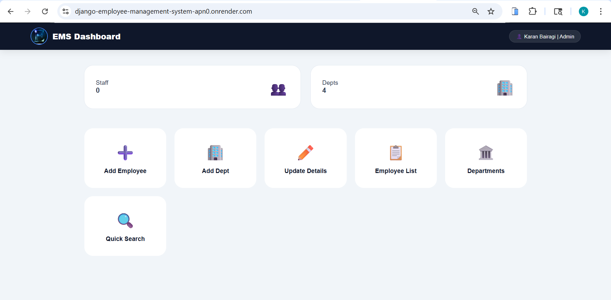
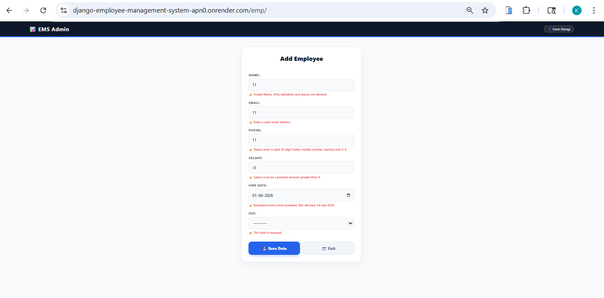
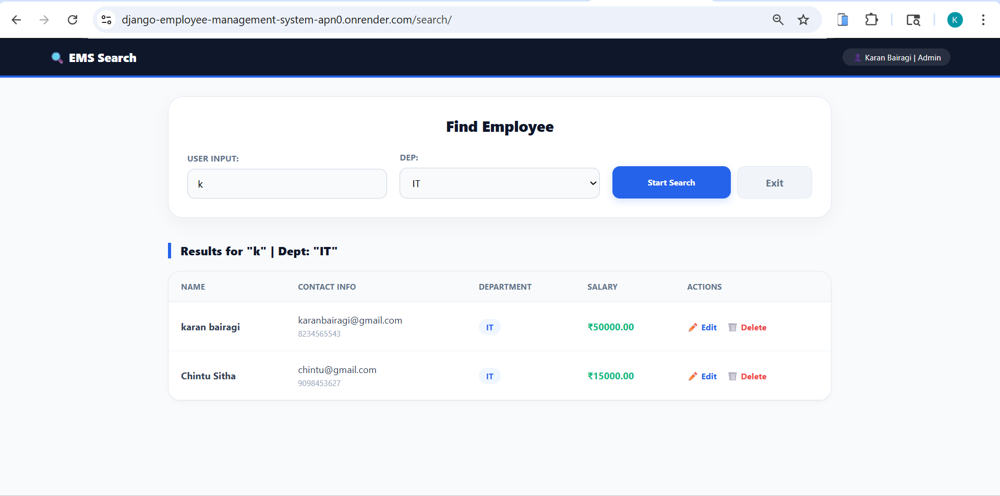

# 🚀 Employee Management System (Django)

[](https://django-employee-management-system-apn0.onrender.com/)
[](https://aiven.io)

A professional **Employee Management Web Application** built using Django. This project features a robust MySQL backend, advanced ORM queries, and real-time user feedback.

---

## 📸 Screenshots


| 📊 Dashboard Overview | ➕ Add Employee Form |
|---|---|
|  |  |

| 🔍 Advanced Search & Filtering |
|---|---|
|  |

---

## 🌐 🔗 Live Demo
👉 **View Live:** [Click Here](https://django-employee-management-system-apn0.onrender.com/)

---

## 🛠️ Technical Highlights (The "Secret Sauce")

### ⚙️ Django ORM & Database
*   **Complex Lookups:** Used **Django ORM** for efficient data filtering and retrieval without raw SQL.
*   **Relational Mapping:** Managed Foreign Key relationships between Employees and Departments.
*   **Cloud Hosting:** Production database hosted on **Aiven MySQL Cloud**.

### 📝 Forms & Feedback Framework
*   **ModelForms:** Integrated `ModelForm` for seamless data binding and automatic form generation.
*   **Messages Framework:** Implemented **Django Contrib Messages** to provide real-time feedback (Success/Error alerts) for CRUD operations.
*   **Robust Validations:** Custom field-level validations for Indian phone formats, unique emails, and salary checks.

---

## 📌 🔥 Features
*   **Full CRUD:** Add, Update, and Delete employees with ease.
*   **Search Engine:** Advanced filtering by Name, Department, or Contact details.
*   **Responsive UI:** Clean, card-based layout designed for both Desktop and Mobile.
*   **Security:** Credentials managed securely via `.env` and `python-dotenv`.

---

## 🏗️ Tech Stack
*   **Backend:** Django (Python)
*   **Database:** MySQL (Aiven)
*   **Frontend:** HTML5, CSS3, JavaScript
*   **Deployment:** Render (with WhiteNoise for static files)

---

## ⚙️ Local Setup

### 1️⃣ Clone & Install
```bash
git clone https://github.com/karan-bairagi/Django-Employee-Management-System
cd Django-Employee-Management-System
pip install -r requirements.txt
```

### 2️⃣ Environment Setup
Create a `.env` file:
```text
DB_NAME=your_db_name
DB_USER=your_db_user
DB_PASSWORD=your_db_password
DB_HOST=your_db_host
DB_PORT=your_db_port
```

### 3️⃣ Run Project
```bash
python manage.py migrate
python manage.py runserver
```

---

## 👨‍💻 Author
**Karan Bairagi**

## ⭐ Support
If you like this project, give it a ⭐ on GitHub!
